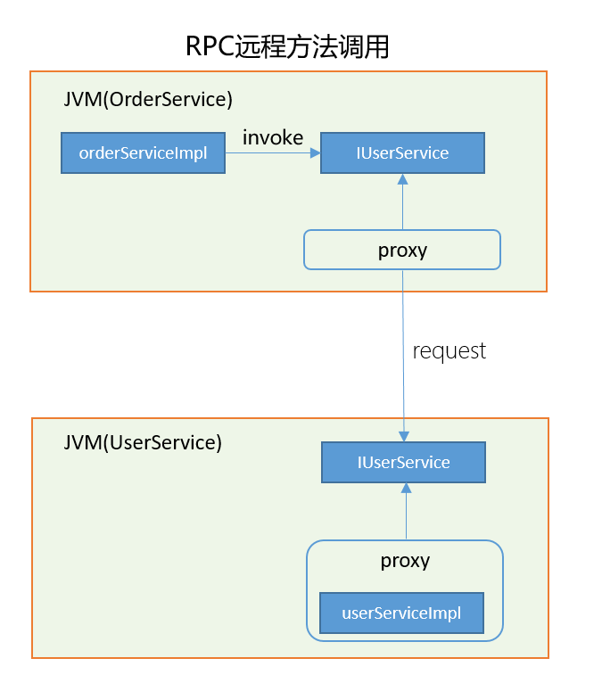

## Dubbo Learning Note

​	为什么要使用分布式架构？分布式架构解决了互联网应用的两大难题：高并发和高可用。高并发指服务器并发处理客户端请求的数量大，而高可用指后端服务能始终处于可用状态。

​	关于高并发，单机所能提供的并发量总是有限的。其受限于网络带宽、单机内存、CPU等。举个例子，假如单机需要10000并发请求，每次请求100KB,则需要10000x0.1MB=1000MB的流量，也就是1000MBx8=8000Mb的带宽（Byte与byte的转换）；如果使用Tomcat容器的默认Socket阻塞通信，每个请求启动一个处理线程，每个线程占用1M，则需要10000MB=10G内存。这会带来高昂的服务器成本。过多的线程会导致CPU的线程切换成本变大，以及JVM的GC能力负担等。而分布式架构可以将请求压力分散到集群的多台机器上。

> 注释：Web容器通常都需要配置最大并发请求数，Tomcat默认为150，也就是Tomcat中用来转发请求的线程池大小。

​	关于高可用，单体应用仅部署在单机上，一旦单点故障，客户端将无法访问服务。为了解决单点问题，引入分布式架构。分布式架构中，同一服务会部署在多台服务器上，一旦一台服务器宕机，其他服务器可以提供相同的服务。

​	Dubbo就是众多分布式框架中优秀的一种。Dubbo自己的定义如下：Apache Dubbo is a high-performance，java based，open source RPC framework. Dubbo是一个高性能的、基于Java的、开源的RPC框架。

​	高性能体现在多个方面，比如基于Netty的异步非阻塞IO，还比如基于TCP协议封装的简洁的dubbo协议。那么，什么是RPC框架呢？

​	在Spring经典的三层架构中，一个service调用另一个service的方法通常如下：

订单服务的实现类中调用用户接口的方法，同时用户接口拥有一个实现类。在Spring环境下运行时，会自动生成用户类的代理实现类，以处理事务、日志等功能。此时，所有的接口和类都存在于同一个JVM中，通过JVM指令来调用方法。

RPC(Remote Procedure Call):远程过程调用，也叫远程方法调用。指一个程序通过网络调用远程程序的方法的过程。分布式环境中，由于程序方法并不在同一JVM种，只能通过网络进行调用。两个服务均依赖同一套接口，而RPC框架则封装了网络请求部分，通过动态代理进行调用，使程序员在调用远程方法时能够像调用本地方法一样顺滑。

Dubbo使用什么网络协议进行远程方法的调用？Dubbo默认的协议为自定义的dubbo协议，同时也支持HTTP、Hessain、gRPC、webService、rmi、redis、rest、thrift、memcached等众多协议。需要用户根据不同的场景选用合适的协议。

- dubbo协议：采用单一长连接和NIO异步通讯，适合于**小数据量** **大并发**的服务调用，以及服务消费者数量远大于服务提供者数量的情况。文件上传等大数据量操作不适合此协议，建议数据量小于100K。数据通过hessian进行二进制序列化。

HTTP协议，HTTP(HyperText Transfer Protocol)：超文本传输协议。它是一种严格规范格式的应用层协议，基于TCP协议，传输的内容是固定格式的文本数据。

RPC框架通常封装了TCP协议进行二进制数据的传输，当然也可以封装HTTP协议来传输文本数据。TCP协议位于OSI模型的第四层，格式简单，传输效率更高。而HTTP协议位于OSI模型的第5、6、7层，封装了更多的格式数据，且文本格式较为松散，传输效率比二进制内容低，因此通常自定义TCP协议格式作为RPC框架的传输协议。当然 HTTP协议也具有一定的优势，比如在一些负载不高的应用中HTTP协议与TCP协议的传输差别并不是系统瓶颈，而HTTP协议能与Web端协议保持一致。而且HTTP/2协议已经对复杂的格式进行了优化，性能提升很多。

关于HTTP与RPC的关系问题，请参阅知乎问答：https://www.zhihu.com/question/41609070

小任务：基于动态代理实现一个简易的RPC框架。