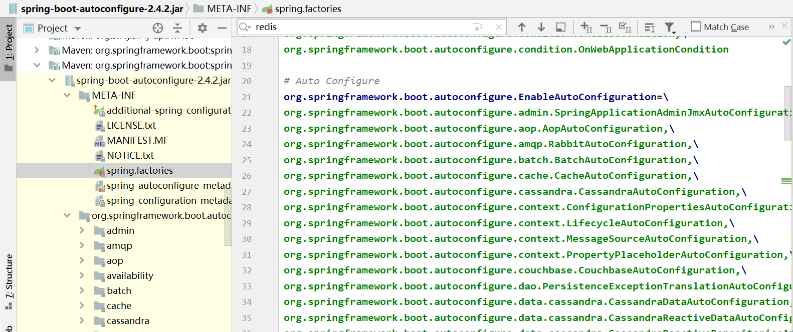

# SpringBoot自动装配原理

## 起源

在SpringBoot出现之前，我们使用Spring的方式是在pom.xml文件中手动引入jar包，然后在xml中手动定义Bean。比如，我们需要搭建web项目，就需要将web相关的所有Jar包引入到pom文件，并手动将Bean注册到xml中。当项目越来越庞大时，这种手动的方式就非常繁琐了。于是SpringBoot诞生了，它提供了自动装配的能力，当我们需要某种功能时，只需要将对应的starter包引入pom.xml，SpringBoot就会自动导入该功能的所有jar包并装配相应的Bean。

```xml
<!-- 当我们需要搭建web工程时，只需要引入spring-boot-starter-web即可，无需其他操作 -->
<dependency>
    <groupId>org.springframework.boot</groupId>
    <artifactId>spring-boot-starter-web</artifactId>
</dependency>
```

那么，SpringBoot是如何做到的呢？

## starter启动器与注解

首先，每个starter都封装了这个功能模块所需要的所有jar包，引入了starter之后，项目运行时就可以在classpath下加载到这些jar包中的类。比如，引入了spring-boot-starter-web之后，classpath下就有了springMVC相关的类。

那么，jar包引入之后，通常还需要进行实例的创建和参数的配置，这个步骤SpringBoot同样为我们实现了。

在springboot的启动类中，默认在类上标注了`@SpringBootApplication`这个注解，该注解是一个复合注解,包含了`@SpringBootConfiguration` 、 `@EnableAutoConfiguration` 和 `@ComponentScan` 注解。

- `@SpringBootConfiguration` 注解包含的核心元注解就是`@Configuration` ，因此可以将其看做`@Configuration` 注解。

- `@ComponentScan` 注解用于开启组件扫描,对所有标注了`@Component`注解的Bean进行扫描，相当于xml配置中的`<context:component-scan base-package="com.foo.bar"/>`; 值得注意的是，`@Configuration`、`@Controller` 、`@Service` 、`@Repository` 注解都包含了`@Component`注解。

-  `@EnableAutoConfiguration` 注解用于开启自动装配，它是一个典型的 `@Enable`前缀系列注解，这一系列的注解的核心元注解为`@Import` ，用于将Bean导入到ApplicationContext中。这里的`@EnableAutoConfiguration`注解的功能即：**将自动装配相关的Bean导入到容器中**。

下面我们来详细分析`@EnableAutoConfiguration` 注解是如何工作的。

上述我们提到，`@EnableAutoConfiguration`注解包含了`@Import`注解，那么首先要明白`@Import`注解的作用和使用方法。

首先，我们来看一下@Import注解的文档：

```java 
Indicates one or more component classes to import, typically {@link Configuration @Configuration} classes.
	表示要导入一个或多个组件，通常与@Configuration一起使用。

Provides functionality equivalent to the {@code <import/>} element in Spring XML.
	提供了与xml中的<import/> 标签相同的功能；
    
Allows for importing {@code @Configuration} classes, {@link ImportSelector} and
{@link ImportBeanDefinitionRegistrar} implementations, as well as regular component classes (as of 4.2; analogous to {@link AnnotationConfigApplicationContext#register}).
	允许导入被@Configuration标注的类、ImportSelector和ImportBeanDefinitionRegistrar接口的实现类以及普通的组件类。
    
{@code @Bean} definitions declared in imported {@code @Configuration} classes should be
accessed by using {@link org.springframework.beans.factory.annotation.Autowired @Autowired} injection. Either the bean itself can be autowired, or the configuration class instance declaring the bean can be autowired. The latter approach allows for explicit, IDE-friendly navigation between {@code @Configuration} class methods.
	在被导入的@Configuration标注的类中，通过@Bean注解声明的Bean可以通过@Autowired注解注入。不仅Bean本身可以被注入，被@Configuration注解标注的实例本身也可以被注入。后一种方法允许精确的、IDE有好的提示。
 
<p>May be declared at the class level or as a meta-annotation.
    该注解可以用在类级别或者作为元注解。
 
<p>If XML or other non-{@code @Configuration} bean definition resources need to be
imported, use the {@link ImportResource @ImportResource} annotation instead.
    如果XML或者其他的非@Configuration标注的资源需要被导入，则需要使用@ImportResource注解替代。
```


通过源码中的说明可知，@Import注解有四种方式来导入Bean到容器中。下面通过代码来展示这四种方式。

首先定义一个POJO类，作为示例：

```java
@Data
public class User {

    private String username;

    private String account;
}
```

`@Import` 注解将User类导入到容器中的方式如下：

- 直接导入这个类

  ```java
  @Configuration
  @Import(User.class)
  public class BeanImportConfig {
  }
  ```

- 导入提供该Bean的被@Configuration注解的类

  ```java
  @Configuration
  @Import(UserConfig.class)
  public class BeanImportConfig {
  }
  ```

  ```java
  @Configuration
  public class UserConfig {
  
      @Bean
      public User getUser(){
          return new User();
      }
  }
  ```

- 通过实现ImportSelector接口并实现selectImports()方法来导入，该方法适合批量导入多个类。

  ```java
  @Configuration
  @Import(UserImportSelector.class) // 这里指定导入选择器即可批量导入多个类
  public class BeanImportConfig {
  }
  ```

  ```java
  // 实现一个导入选择器，用于批量的指定想要导入的类，selectImports方法指定想要导入的类的全限定名，该方法会在spring执行refresh时被调用
  public class UserImportSelector implements ImportSelector {
  
      @Override
      public String[] selectImports(AnnotationMetadata importingClassMetadata) {
          return new String[]{User.class.getName()};
      }
  
      @Override
      public Predicate<String> getExclusionFilter() {
          return null;
      }
  }
  ```


- 通过实现ImportBeanDefinitionRegistrar接口并导入该实现类，该方法适合需要对容器中的类定义进行更多操作的场景，比如新增、修改、删除、查询类定义

  ```java
  @Configuration
  @Import(UserImportBeanDefinitionRegistrar.class) // 在Configuration中导入一个类定义注册器的实现类，对类定义进行操作
  public class BeanImportConfig {
  }
  ```

  ```java
  // 类定义注册器的自定义实现，通过registerBeanDefinitions方法对类定义进行操作
  public class UserImportBeanDefinitionRegistrar implements ImportBeanDefinitionRegistrar {
  
      @Override
      public void registerBeanDefinitions(AnnotationMetadata importingClassMetadata, BeanDefinitionRegistry registry) {
          registry.registerBeanDefinition("user",new RootBeanDefinition(User.class));
          registry.removeBeanDefinition(User.class.getName());
      }
  }
  ```

  我们通过查看@EnableAutoConfiguration注解的源码可以得知，SpringBoot通过@Import注解引入了一个ImportSelector接口的实现类来实现Bean的自动配置。源码如下：

  ```java
  @Import(AutoConfigurationImportSelector.class)
  public @interface EnableAutoConfiguration {
      ...
  }
  ```

那么问题来了，为什么通过@Import注解导入了AutoConfigurationImportSelector就可以做到自动配置呢？

通过前面对@Import用法的学习我们已经知道，ImportSelector接口用于批量导入配置类或者Bean，Spring容器启动时，在refresh()方法中最终会调用到该接口的selectImports()方法，获取该方法所提供的类全限定名组成的数组。因此，我们进入源码查看AutoConfigurationImportSelector这个类的selectImports()方法提供了哪些类的全限定名。

```java
// AutoConfigurationImportSelector.java
// 向Spring提供配置类的全限定名
@Override
public String[] selectImports(AnnotationMetadata annotationMetadata) {
	if (!isEnabled(annotationMetadata)) {
		return NO_IMPORTS;
	}
	AutoConfigurationEntry autoConfigurationEntry = getAutoConfigurationEntry(annotationMetadata);
	return StringUtils.toStringArray(autoConfigurationEntry.getConfigurations());

// 获取候选配置的列表，进行去重过滤等检查后返回
protected AutoConfigurationEntry getAutoConfigurationEntry(AnnotationMetadata annotationMetadata) {
	if (!isEnabled(annotationMetadata)) {
		return EMPTY_ENTRY;
	}
	AnnotationAttributes attributes = getAttributes(annotationMetadata);
	List<String> configurations = getCandidateConfigurations(annotationMetadata, attributes);
	configurations = removeDuplicates(configurations);
	Set<String> exclusions = getExclusions(annotationMetadata, attributes);
	checkExcludedClasses(configurations, exclusions);
	configurations.removeAll(exclusions);
	configurations = getConfigurationClassFilter().filter(configurations);
	fireAutoConfigurationImportEvents(configurations, exclusions);
	return new AutoConfigurationEntry(configurations, exclusions);
}

// 通过SpringFactoriesLoader获取META-INF/spring.factories文件中对应的类路径列表
protected List<String> getCandidateConfigurations(AnnotationMetadata metadata, AnnotationAttributes attributes) {
	List<String> configurations = SpringFactoriesLoader.loadFactoryNames(getSpringFactoriesLoaderFactoryClass(),
			getBeanClassLoader());
	Assert.notEmpty(configurations, "No auto configuration classes found in META-INF/spring.factories. If you "
			+ "are using a custom packaging, make sure that file is correct.");
	return configurations;
}
    
// 返回EnableAutoConfiguration这个类
protected Class<?> getSpringFactoriesLoaderFactoryClass() {
	return EnableAutoConfiguration.class;
}
```

这段代码的执行逻辑如下：

-  @Import注解导入AutoConfigurationImportSelector类；

- Spring容器执行refresh()方法时调用AutoConfigurationImportSelector类的selectImports方法；

- selectImports方法通过调用其他方法最终调用到getCandidateConfigurations方法来获取配置类列表；

- getCandidateConfigurations方法通过SpringFactoriesLoader加载当前类所在jar包下的META-INF/spring.factories文件，并获取文件中`org.springframework.boot.autoconfigure.AutoConfigurationImportFilter`对应的配置类列表，最终这个列表会通过selectImports方法返回。

  下图是spring.factories文件中找到的配置类列表的部分截图：

  

从图中我们可以看到大量的配置类的全限定名，Spring会加载这些类并对类中的@Bean进行实例化。

例如`org.springframework.boot.autoconfigure.web.servlet.WebMvcAutoConfiguration`这个配置类，该类是用于配置Web环境的类，部分内容如下：

```java
// WebMvcAutoConfiguration.java
@Configuration(proxyBeanMethods = false)
@ConditionalOnWebApplication(type = Type.SERVLET)
@ConditionalOnClass({ Servlet.class, DispatcherServlet.class, WebMvcConfigurer.class })
@ConditionalOnMissingBean(WebMvcConfigurationSupport.class)
@AutoConfigureOrder(Ordered.HIGHEST_PRECEDENCE + 10)
@AutoConfigureAfter({ DispatcherServletAutoConfiguration.class, TaskExecutionAutoConfiguration.class,
		ValidationAutoConfiguration.class })
public class WebMvcAutoConfiguration {
    
	@Bean
	@ConditionalOnMissingBean(HiddenHttpMethodFilter.class)
	@ConditionalOnProperty(prefix = "spring.mvc.hiddenmethod.filter", name = "enabled", matchIfMissing = false)
	public OrderedHiddenHttpMethodFilter hiddenHttpMethodFilter() {
		return new OrderedHiddenHttpMethodFilter();
	}

}
```

@Configuration注解表明了该类为配置类，类中的@Bean注解的方法会返回Bean实例；

@Conditional系列注解表示在某些条件下执行，例如@ConditionalOnWebApplication表示需要在Web应用中才能使用该配置，@ConditionalOnClass表示在classpath下需要有指定的类才可以使用；@Conditional系列的其他注解类似的见名知意。

由此，Spring自动配置的原理就彻底明白了。通过加载spring-boot-autoconfigure.jar中的预先写好的JavaConfig来完成约定的配置，执行配置时会通过@Conditional系列注解先判断classpath下是否有相应的类，也就是说pom文件中是否引入了相应的start或者jar包，如果并没有引入该类，则不会执行相关的配置方法。

## 总结

 

